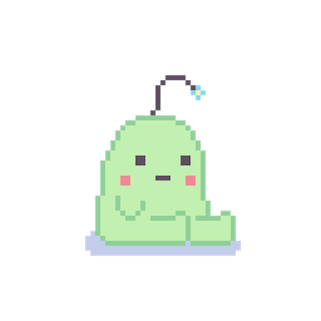

Virtual pets are a source of nostalgia for all of us. Whether it was Tamagotchi, Neopets, Webkinz, etc our beloved virtual friends were always a huge part of our lives. I wanted to bring this experience back with this interactive game I made with my group for my ICS 111 class. In this game, players can feed the cute creature and help it grow! Once it has eaten enough, it will successfully grow into an adult creature and the player wins the game. 
We used EZ Graphics to create this game, and I found it very useful because it allowed us to incorporate graphics with sound easily and in an intuitive way. By creating different classes and manipulating the properties of the components of the game, we were able to come up with a concept that was simple but could be easily added on to. Here is a snippet of our “game” class, where we set the background and the different stages of the game:

```
public class game {
	
	public static void main(String[] args) {
		EZ.initialize(800, 800);
		EZImage game_over = EZ.addImage("gameover.png", 400, 400);
		game_over.pushToBack();
		EZImage background = EZ.addImage("background.png", 400, 400);
		EZText age;
		EZSound eat = EZ.addSound("eat.wav");
		EZSound clean = EZ.addSound("fart.wav");
		EZSound play = EZ.addSound("play.wav");
		Pet pet = new Pet();
		Toy toy = new Toy();
		
		//Set age variable with text along with time
		long time = System.currentTimeMillis();
		int year = 0;
		Color pink = new Color(255, 175, 175);
		age = EZ.addText(700, 50, "Age: " + year, pink, 50);
		}	
	}
    
```

Something very useful I learned during this project was currentTimeMillis(), which returns a UNIX timestamp in milliseconds. We used this to calculate how long the creature had been alive and to show players how old it was. I utilized this function in future assignments, and I found it to be very helpful as it could be incorporated in many different ways.


This was the first computer science related group project I had ever done, and I found it to be a really rewarding experience to be able to brainstorm with others and reach our goals together. My group members and I created a very collaborative environment where we felt comfortable reaching out to each other to pitch new ideas or ask for help. Working with others during this project really made me think about the kind of environment I would like to work in, and I came to the conclusion that I would most likely be able to succeed in an open and interactive group setting as opposed to working alone. I believe this is true for many others as well, since I feel that humans are social animals who benefit more from sharing with others. 

 
Source: <a href="https://github.com/bhavanikay/FeedTheCreatureGame"><i class="large github icon"></i>bhavanikay/FeedTheCreatureGame</a>
