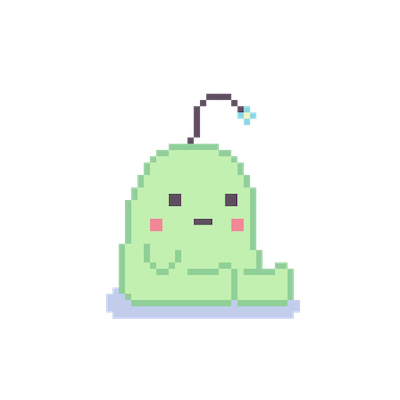

Virtual pets are a source of nostalgia for all of us. Whether it was Tamagotchi, Neopets, Webkinz, etc our beloved virtual friends were always a huge part of our lives. I wanted to bring this experience back with this interactive game. In this game, you can feed the creature and help it grow! Once you feed it enough, you will have successfully raised it into an adult creature and win the game. We took many components to put this game together, such as the background and the design of the creature. It comes with sound effects to know when it is being fed and to enhance the overall experience of the game. 

This is a project I did with a group for my ICS 111 class, and we split up the tasks evenly. I was in charge of finding the images and the sound effects that would eventually go into our game. I was also in charge of incorporating them into the game, but our entire group brainstormed to come up with this idea. I learned a lot about teamwork during the course of this project. When you are a part of a safe and creative environment, even the people who do not speak up too often will share great ideas. It was fun to brainstorm with my group members, and it was a great learning experience for me as I heard many ideas that I would not have initially thought about. 
 
Source: <a href="https://github.com/bhavanikay/FeedTheCreatureGame"><i class="large github icon"></i>bhavanikay/FeedTheCreatureGame</a>
